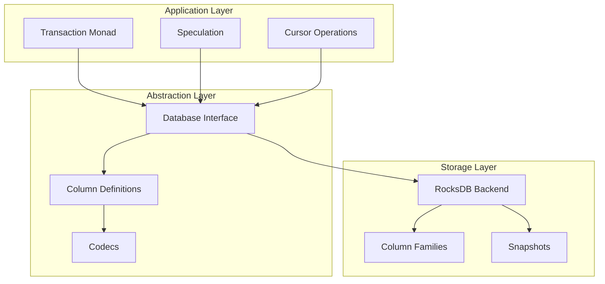

# Architecture Overview

## Design Philosophy

The library is built around four core principles:

1. **Type Safety** - Column keys and values are typed at compile time
2. **Modularity** - Backend-agnostic abstractions with RocksDB implementation
3. **Composability** - Transaction operations compose monadically
4. **Snapshot Isolation** - All reads within a transaction see a consistent point-in-time view

## Component Diagram



## Library Structure

```
rocksdb-kv-transactions/
├── src/
│   ├── kv-transactions/          # Internal sublibrary
│   │   └── Database/KV/
│   │       ├── Database.hs       # Core abstractions
│   │       ├── Transaction.hs    # Transaction monad
│   │       ├── Cursor.hs         # Iterator operations
│   │       └── Query.hs          # Read-only queries
│   └── rocksdb-kv-transactions/  # Main library
│       └── Database/KV/
│           └── RocksDB.hs        # RocksDB backend
└── test/                         # Unit tests
```

## Type-Safe Columns

The key innovation is using GADTs to define typed column selectors:

```haskell
data Columns c where
    Users :: Columns (KV UserId User)
    Posts :: Columns (KV PostId Post)
```

The `KV` phantom type carries the key and value types:

```haskell
data KV k v

type family KeyOf c where
    KeyOf (KV k v) = k

type family ValueOf c where
    ValueOf (KV k v) = v
```

This ensures that `query Users someKey` only typechecks if `someKey :: UserId`.

## DMap for Heterogeneous Storage

Column metadata is stored in a `DMap` (dependent map) which allows different value types per key:

```haskell
columns :: DMap Columns (Column cf)
codecs  :: DMap Columns Codecs
```

This is enabled by the `dependent-map` package and requires `GCompare` instances.
