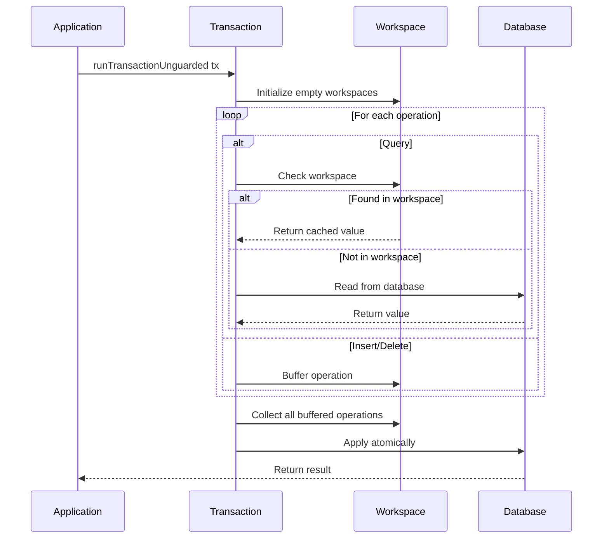

# Transaction Architecture

## Operational Monad Pattern

Transactions are built using the operational monad pattern from the `operational` package. This separates the description of operations from their interpretation:

```haskell
data TransactionInstruction m cf t op a where
    Query    :: t c -> KeyOf c -> TransactionInstruction m cf t op (Maybe (ValueOf c))
    Insert   :: t c -> KeyOf c -> ValueOf c -> TransactionInstruction m cf t op ()
    Delete   :: t c -> KeyOf c -> TransactionInstruction m cf t op ()
    Iterating :: t c -> Cursor (...) c a -> TransactionInstruction m cf t op a
    Reset    :: Maybe (t c) -> TransactionInstruction m cf t op ()

type Transaction m cf t op = ProgramT (TransactionInstruction m cf t op) (Context cf t op m)
```

## Execution Model

Transactions use an optimistic approach:



## Workspace Buffering

Each column has its own workspace that buffers pending changes:

```haskell
newtype Workspace c = Workspace (Map (KeyOf c) (Maybe (ValueOf c)))

type Workspaces t = DMap t Workspace
```

- `Just value` indicates a pending insert
- `Nothing` indicates a pending delete

## Read-Your-Writes Semantics

Queries first check the workspace before hitting the database:

```haskell
interpretQuery t k = do
    workspaces <- get
    case DMap.lookup t workspaces of
        Just (Workspace ws) ->
            maybe fetchFromDB pure $ Map.lookup k ws
        Nothing -> fetchFromDB
```

This ensures you see your own uncommitted writes within a transaction.

## Concurrency Control

Two options for running transactions:

### Unguarded (Single-threaded)

```haskell
runTransactionUnguarded :: Database m cf t op -> Transaction m cf t op a -> m a
```

No synchronization - use only when you can guarantee single-threaded access.

### Serialized (Multi-threaded)

```haskell
newRunTransaction :: Database n cf t op -> m (RunTransaction n cf t op)

runner <- newRunTransaction db
forkIO $ runTransaction runner tx1
forkIO $ runTransaction runner tx2
```

Uses an MVar mutex to ensure only one transaction executes at a time.

## Atomic Commit

At the end of a transaction, all buffered operations are converted to batch operations and applied atomically:

```haskell
ops <- mapM toBatchOps $ DMap.toList workspaces
applyOps $ concat ops
```

RocksDB guarantees atomic batch writes.
